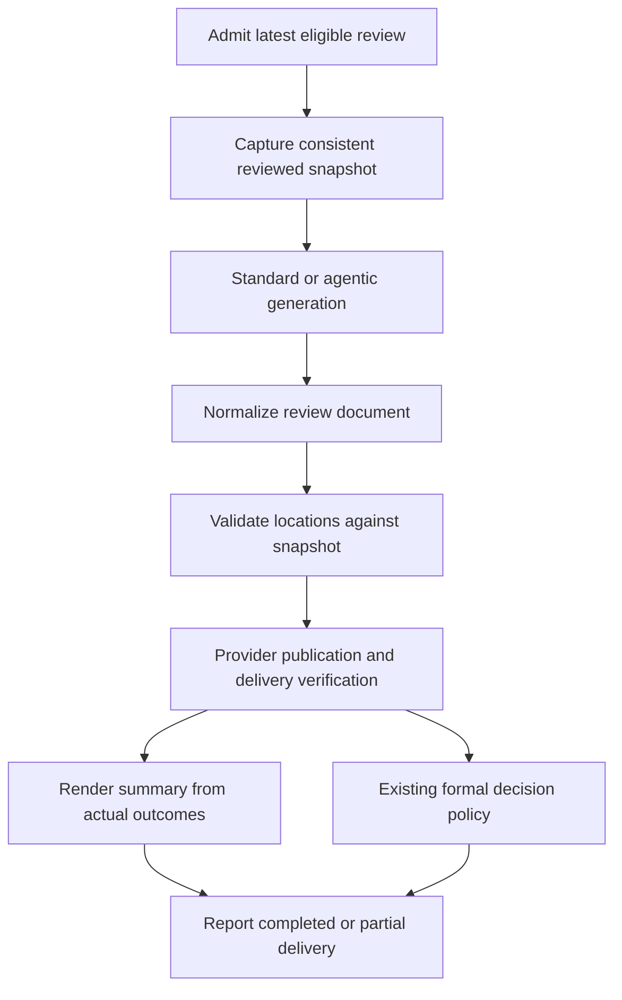
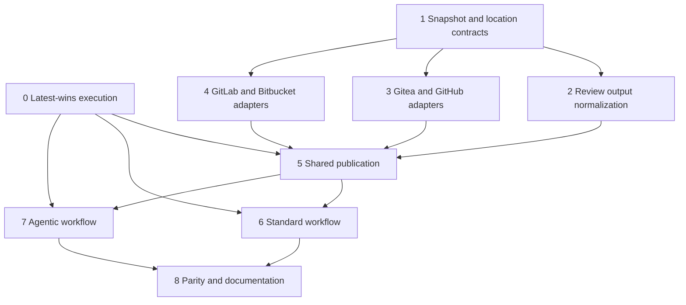

# feat: Publish AI Findings as Native Inline Reviews

## Overview

Replace location-like Markdown headings in generated reviews with native,
single-line review comments. Both standard and agentic reviews produce a shared
review document; the application validates locations against an immutable
reviewed diff and publishes through the existing repository adapters.

Preserve a concise overall summary, existing formal decisions, and full feedback
for findings that cannot be anchored or published safely. No feature setting,
new provider, historical comment conversion, or thread lifecycle redesign is
introduced. The user subsequently added latest-review-wins cancellation across
both review types and agentic precedence for same-update dual enablement.

| Finding state | Presentation |
|---|---|
| Valid, supported, revision-bound location | Native inline detail; no duplicate summary detail |
| Valid Gitea location with unchanged-PR checks | Native inline detail under the accepted race exception; detected mismatches are publication failures |
| No valid/supported safe location, or review-wide observation | Summary detail and available references; no placement explanation |
| Definitely failed inline write | Summary detail plus explicit publication failure |
| Unconfirmed write after transport failure | Summary detail plus explicit uncertainty; never claim success or blindly resend |

## Problem Frame

The existing workflows accept free-form AI review text and publish it as one
body. The Gitea adapter already supports inline comments, but generated findings
never reach that operation. The same gap exists across the four adapters.
Reviewers need correctly placed comments they can discuss in native threads,
not text asking them to find the code themselves.

Source of truth:
`docs/brainstorms/2026-10-06-inline-review-comments-requirements.md`.
The follow-up planning decisions are recorded there: strict location safety
over Bitbucket inline coverage; a user-approved checked, best-effort Gitea
28.0.0 exception; and no new stale-revision gate for configured formal decisions.

## Requirements Trace

- R1: Both review workflows normalize generated output and use one publisher
  (Units 2, 5, 6, 7).
- R2: Extend the four existing adapters; represent capabilities honestly,
  including Bitbucket summary fallback (Units 1, 3, 4).
- R3: Inline eligible findings automatically; no option or migration to enable
  the behavior (Units 5, 6, 7).
- R4: Concise summary, nonduplicated inline detail, existing decisions
  (Units 3, 4, 5, 6, 7).
- R5: Preserve review-wide/unplaceable findings without routine placement
  explanations (Units 2, 5).
- R6: Meaningful bodies and validated snapshot-relative file/side/line anchors
  (Units 1, 2, 5).
- R7: Old/deleted and new/added lines where supported (Units 1, 3, 4).
- R8: Exact reviewed revision; conservative unsafe-location fallback, with
  user-approved unchanged-PR checks and mismatch reporting for Gitea 28.0.0
  (Units 1, 3, 4, 5).
- R9: Explicit per-write outcomes, partial failure preservation, no false
  success or blind retries (Units 3, 4, 5, 6, 7).
- R10: Preserve triggers, exclusions, severity, events, actions, follow-ups, and
  existing formal-action behavior after a concurrent push, except for the
  explicit latest-wins execution rules (Units 0, 6, 7, 8).
- R11: No cross-run deduplication, replacement, or resolution; retain posted
  superseded output (Units 0, 5, 6, 7).
- R12: New requests cancel either older review type, fence further writes, and
  discard late results while the newest review starts (Units 0, 5, 6, 7, 8).
- R13: Agentic wins same-update dual enablement; later explicit review requests
  still supersede older work (Units 0, 8).

## Scope Boundaries

- Single-line anchors only. No multi-line ranges or native file-only comments.
- No automatic code fixes or suggested-change application.
- No new review quality or severity policy.
- No new settings or persistence for cross-run comment management.
- No retroactive conversion, historical reconciliation, or automatic thread
  resolution. Read-back of this run's writes is delivery verification, not
  reconciliation across reviews.
- Latest-wins execution is in scope; deleting old comments or forcibly recalling
  a provider request that has already been sent is not.
- Bitbucket means Cloud, not Server/Data Center.
- Planning only: implementation and runtime/provider experiments follow later.

## Context & Research

### Relevant Code and Patterns

- Java 21, Maven, Spring Boot 4.0.5 (`pom.xml`). Follow existing Java and
  dependency conventions; no new parser/library is justified at planning time.
- `src/main/java/org/remus/giteabot/repository/RepositoryApiClient.java`:
  provider-neutral review operations. Its existing inline helper has a new-line
  coordinate and void return, insufficient for side/revision/outcome handling.
- `src/main/java/org/remus/giteabot/review/CodeReviewService.java`:
  initial chunked review, truncated retries, session updates, and incoming
  inline-comment follow-ups.
- `src/main/java/org/remus/giteabot/review/DiffFileFilter.java`: standard review
  exclusions; retain this authority for model input and anchor eligibility.
- `src/main/java/org/remus/giteabot/prworkflow/review/ReviewWorkflow.java`:
  existing triggers and separate configured post-review action.
- `src/main/java/org/remus/giteabot/prworkflow/agentreview/AgentReviewService.java`:
  agentic review publication, trailing severity classification, thresholds,
  structured finding events, formal-action fallback.
- `src/main/java/org/remus/giteabot/prworkflow/agentreview/ReviewAgentStrategy.java`:
  native/legacy read-only exploration, completed final-text acceptance, legacy
  plan extraction, and incomplete-turn rejection.
- `src/main/java/org/remus/giteabot/prworkflow/agentreview/DiffSummary.java`:
  file statistics and raw diff blocks, not a line-coordinate parser.
- Existing provider `*ApiClientTest.java` classes use
  `MockRestServiceServer`; workflow/service tests use JUnit, Mockito, and
  AssertJ. Add contract and integration cases in these established suites.
- `src/main/java/org/remus/giteabot/prworkflow/PrWorkflowRunService.java`
  already cancels previous active rows by bot/PR/workflow key; terminal rows
  cannot be overwritten by a late completion.
- `src/main/java/org/remus/giteabot/prworkflow/PrWorkflowRunLockManager.java`
  serializes start transactions in one JVM, keyed separately per workflow.
  Its documented deployment scope is single-instance, not a distributed lock.
- `src/main/java/org/remus/giteabot/prworkflow/PrWorkflowContext.java`
  exposes cancellation checks. The two review workflows check mainly before
  invoking their services; the agent loop has no explicit cancellation polling.
- `src/main/java/org/remus/giteabot/prworkflow/PrWorkflowOrchestrator.java`
  runs selected workflows sequentially, while
  `src/main/java/org/remus/giteabot/admin/BotWebhookService.java` dispatches
  webhook work asynchronously. Request admission must precede that queue.
- No root/project `AGENTS.md`, matching existing plan, or institutional
  `docs/solutions/` document was found during the scoped scan.

### External Contracts

| Provider | Placement contract | Publication and limitations |
|---|---|---|
| GitHub | Review `commit_id`; comment `path`, `line`, `side` LEFT/RIGHT | Summary/event/comments can share a request. Do not assume batch atomicity; verify review and comment IDs. Use current line/side fields, not deprecated diff offsets. |
| Gitea 28.0.0 | Review `commit_id`; `path` and `old_position` or `new_position` are file line numbers | Summary/event/comments can share a request, but patch construction still reads the current PR head. Use user-approved prechecks/read-back, not a claim of fully pinned placement. Failed batches may leave pending comments. |
| GitLab | Diff version's base/start/head SHAs, old/new paths, old/new lines | One discussion per finding; summary and decision are separate operations. Added lines use new line, deleted lines old line, context lines both coordinates. Missing refs are an explicit failure. |
| Bitbucket Cloud | Documented comment request has no reviewed-revision binding | No claim of strict inline safety from before/after checks. Use summary fallback under the user's R8 decision unless a documented stronger contract is established. |

GitLab SHA metadata must identify the diff version used for review, not freshly
fetched current refs at write time. Single-path APIs still need correct
rename-path mapping; lack of a dual-path field is not proof that all rename
comments are unsupported. Verify supported mappings rather than retarget lines.

Initial Gitea research used development source; follow-up research checked the
user-confirmed v28.0.0 structs, API handler, and service. The service can use the
review commit for new-line blame while generating the stored patch from the
current PR head and merge base. Old-line handling also uses that current diff.
Thus `commit_id` alone is not proof of fully historical comment construction.
The user explicitly approved unchanged-PR checks and detected-mismatch reporting
for Gitea, accepting the residual race but not extending that exception to
Bitbucket. Bitbucket side mapping is not needed for strict fallback.

## Key Technical Decisions

| Decision | Rationale and tradeoff |
|---|---|
| Shared typed review document and publisher | Standard and agentic generation differ, but placement, fallback, and delivery bookkeeping must not diverge. |
| App-owned output instructions and strict parsing | Operator role prompts remain editable. The application requests a predictable envelope and retains legacy text when parsing cannot safely recover it. |
| Immutable reviewed snapshot, separate from finding output | Models cannot select commit IDs or convert provider coordinates. Anchors are validated against the exact diff used for generation. Gitea is a disclosed best-effort transport exception, not an exception to validating the requested anchor. |
| Add a richer publication seam; retain existing incoming-comment helper | Avoid widening the blast radius to human inline follow-ups while enabling side/revision/outcome handling for generated reviews. |
| Provider-specific batching, with explicit outcomes | Preserve one coherent review where APIs support it without treating multiple writes as a transaction. Verify Gitea/GitHub batches rather than assuming atomicity. |
| Severity and action policy independent of placement | Unplaceable or failed-inline findings still count. Never recompute severity from successfully posted comments. |
| No blind write retry | A timeout can occur after the server commits a comment. Bounded read-back can confirm this run's writes; ambiguity remains visible if verification cannot establish the result. |
| Shared latest-review generation token and cancellation signal | One bot/PR review family replaces workflow-specific winner selection; request admission and dispatch are separate so delayed workers cannot supersede newer requests. |
| Short publication fences, not a lock around generation | A new request promptly cancels old work. Old in-flight writes may finish, but no later write is admitted; the newest publisher does not mix with an old Gitea batch. |

Prefer a small canonical output envelope with summary and findings. A finding
has comment text, optional path and single-line old/new side coordinates, and
existing severity/category metadata where present. Review-wide findings need
no anchor. A tolerant parser accepts a well-formed fenced or bare envelope,
validates field types, and retains invalidly located findings for summary.
Do not scrape `[Comment on ...]` prose and guess a missing line.

The agentic formal-decision block remains independently interpreted with its
existing counts/thresholds and event semantics. Do not introduce a second
competing classification policy inside the new review envelope. Preserve
optional structured event metadata from the existing classification block,
even when all inline placements fail.

Supersession is not an AI/provider failure. A cancelled run must not publish
failure, fallback, or retry notices. Its existing run record remains CANCELLED,
and cleanup must be owned by that run. A local cancellation signal requests
termination of AI/tool work and suppresses any late response, even if a remote
provider cannot immediately abort computation.

## Open Questions

### Resolved During Planning

- **Which provider abstraction?** Extend `RepositoryApiClient` and its four
  existing adapters; no new Gitea-only adapter.
- **Revision race on Bitbucket?** User chose summary fallback where its API
  cannot guarantee correct placement, rather than accept a wrong-line race.
- **Revision race on Gitea 28.0.0?** Tagged source demonstrates mixed
  reviewed/current-head construction. User chose inline comments after checking
  the PR is unchanged, with post-write verification and explicit detected-mismatch
  reporting. Do not describe this as eliminating the concurrent-push race.
- **Formal decisions after new commits?** User explicitly chose existing
  submission behavior. Do not add a new withholding gate; strict snapshot
  safety applies to inline locations, not a new approval policy.
- **Concurrent review requests?** User explicitly chose latest-wins across
  standard and agentic reviews, not queued full-review publication. Keep already
  posted comments and output from already-sent requests, but admit no further
  old-run writes after cancellation.
- **Both workflows enabled for one update?** Select agentic once for that update;
  do not start standard only to cancel it because agentic happened to run later.
- **Stale revision versus superseded run?** A head advance alone does not add a
  new formal-action gate. A newer admitted review request cancels the older run
  and prevents further action writes as part of the user-directed latest-wins rule.
- **What if summary/error fallback itself fails?** Report confirmed, failed,
  and unknown components through existing logs/run failure channels. Do not
  claim success or introduce endless fallback-comment attempts.
- **New persistence/settings?** None required by the agreed product scope.
  Delivery tracking is run-local; existing session history remains intact.
- **How to deal with uncertain writes?** Read back this run's specific
  resources where IDs are available. Without IDs, compare against a bounded,
  paginated pre-write baseline and run-local identities. An ambiguous or
  incomplete match remains unknown, not successful or definitely absent.

### Deferred to Implementation

- Validate Gitea 28.0.0 old-side/rename display and mismatch detection with API
  fixtures and a disposable instance, using the tagged source below. Inspect
  returned diff-hunk/coordinate data rather than assuming `commit_id` guarantees
  correct patch display.
- Establish adapter-specific read-back visibility of persisted pending versus
  submitted review comments after partial Gitea failure. Pending/unsubmitted
  comments are not confirmed published findings.
- Validate GitHub historical commit/rename anchors and GitLab diff-version
  behavior in contract fixtures, then disposable-provider checks. If a case
  cannot be proven safe, classify its location as unsupported and keep it in
  the summary rather than inventing a workaround, except for Gitea's explicitly
  accepted concurrent-update transport risk.
- Final helper names and package factoring are implementation details. Paths
  below identify intended seams, not a mandate to duplicate existing helpers.
- Actual response size/batch limits depend on supported provider versions.
  Implement documented limits when encountered; do not silently drop excess
  findings or blindly truncate comment bodies.
- Confirm which AI transports support aborting an in-flight request. All paths
  must promptly signal cancellation, stop retries/rounds, and discard late results
  regardless of abort support; do not promise a remote computation has stopped.
- The existing coordinator is documented as single-instance. Reuse that scope
  and existing run records; cross-instance locking is not silently introduced
  as a new infrastructure project.

## High-Level Technical Design

> This illustrates the intended approach and is directional guidance for review,
> not implementation specification. The implementing agent should treat it as
> context, not code to reproduce.

Summary and action may be combined in a provider-native request. The diagram
expresses responsibilities, not a universal write ordering. GitHub/Gitea can
submit summary/action/comments together when the summary is known before
submission. After definite rejection or partial delivery, post a supplemental
failure summary containing only unconfirmed/unpublished detail, not the whole
review again. GitLab publishes individual findings before composing its summary,
then performs the existing separate formal action.

## Implementation Units

- [x] **Unit 0: Latest-wins review execution and cancellation**

**Goal:** Make new review requests supersede either older review type, select
agentic for same-update dual enablement, and prevent cancelled work from publishing.

**Requirements:** R10, R11, R12, R13.

**Dependencies:** None; develop alongside Units 1 through 4.

**Files:**
- Modify: `src/main/java/org/remus/giteabot/admin/BotWebhookService.java`.
- Modify: `src/main/java/org/remus/giteabot/prworkflow/PrWorkflowOrchestrator.java`.
- Modify: `src/main/java/org/remus/giteabot/prworkflow/PrWorkflowRunService.java`.
- Modify as needed: `src/main/java/org/remus/giteabot/prworkflow/PrWorkflowRunRepository.java`.
- Modify: `src/main/java/org/remus/giteabot/prworkflow/PrWorkflowRunLockManager.java`.
- Modify as needed: `src/main/java/org/remus/giteabot/prworkflow/PrWorkflowContext.java`.
- Create: `src/main/java/org/remus/giteabot/prworkflow/ReviewRunCoordinator.java`.
- Create if needed: `src/main/java/org/remus/giteabot/prworkflow/ReviewExecutionDispatcher.java`.
- Modify as needed: `src/main/java/org/remus/giteabot/prworkflow/agentreview/AgentReviewSlashCommandHandler.java`.
- Modify: `src/main/java/org/remus/giteabot/agent/loop/AgentLoop.java`.
- Modify as needed: `src/main/java/org/remus/giteabot/agent/loop/AgentRunContext.java`.
- Modify as needed: `src/main/java/org/remus/giteabot/ai/RetryAiClient.java`.
- Test: `src/test/java/org/remus/giteabot/prworkflow/ReviewRunCoordinatorTest.java`.
- Test: `src/test/java/org/remus/giteabot/prworkflow/PrWorkflowOrchestratorTest.java`.
- Test: `src/test/java/org/remus/giteabot/prworkflow/PrWorkflowRunServiceTest.java`.
- Test: `src/test/java/org/remus/giteabot/admin/BotWebhookServiceTest.java`.
- Test: `src/test/java/org/remus/giteabot/ai/RetryAiClientTest.java`.
- Test: `src/test/java/org/remus/giteabot/agent/loop/AgentLoopTest.java`.
- Test: `src/test/java/org/remus/giteabot/prworkflow/agentreview/AgentReviewSlashCommandHandlerTest.java`.

**Approach:**
- Scope a review-family generation token to bot/provider/repository/PR,
  independent of standard/agentic workflow key. Reuse run records for durable
  CANCELLED status; use run-local cancellation signals and worker handles.
- Admit eligible requests synchronously before asynchronous work is queued.
  A worker that starts late validates its admission token rather than creating
  a newer winner simply because it was scheduled later.
- Keep asynchronous execution behind a managed dispatcher/worker boundary;
  do not rely on Spring self-invocation of an `@Async` method to create a worker.
  Explicit review commands use the same admission boundary as webhook reviews.
- For one update select agentic when both review types are eligible. Keep
  non-review workflow selection and human clarification/reply handling separate;
  do not cancel E2E, documentation, translation, or issue workflows.
- Mark older review generation cancelled and request its worker/transport
  interruption. Poll before/after AI calls, retries, chunk requests, agent
  rounds, context tools, session writes, and publication admission.
- Carry cancellation through shared helpers with no-op defaults for unrelated
  agent workflows. Preserve interruption and cancellation instead of converting
  them into normal provider failure, retry, or a bot error comment.
- Use the review-family admission token as a publication fence. Request
  admission/cancellation must not wait for an entire old generation or review
  to complete. Serialize only the in-flight publication boundary needed to
  prevent mixing Gitea pending batches. A sent request can settle; after it
  settles, the old run cannot initiate another write.
- Propagate cancellation exceptions to the existing orchestrator cancellation
  handling. Late AI results and late completion cannot change CANCELLED to
  SUCCESS or publish summary/action/fallback/error/retry notices.
- Each run cleans only its own temporary workspace/resources. Latest-run startup
  must not reuse a workspace whose cancelled owner can still clean it up.

**Patterns to follow:** Existing run cancellation, `requireActive`, start
transaction locking, terminal-status preservation, and per-run temporary
workspaces. Do not add cross-run comment bookkeeping or new user settings.

**Execution note:** Characterize existing cancellation before changing run
selection; use deterministic latches/fakes for concurrency tests, not sleeps.

**Test scenarios:**
- Integration: old standard run blocked in AI, new agentic request admitted;
  old run is cancelled, new generation starts, and late old response produces
  no publication, action, fallback, retry notice, or session contamination.
- Integration: reverse workflow order and same-workflow resync also cancel the
  older run; a delayed old worker cannot reclaim latest status.
- Edge case: one update with both enabled types starts only agentic; later
  explicit standard request can supersede it. Unrelated workflows remain active.
- Error path: transport ignores abort or returns after cancellation; result is
  discarded and no retries/rounds are scheduled. Cancellation is not FAILED.
- Integration: manual review and webhook admission share latest-run state;
  asynchronous dispatch preserves existing execution behavior and unrelated
  agent loops retain their default noncancelled behavior.
- Integration: supersession during an already-sent comment/batch retains its
  eventual remote output but fences every subsequent old-run write.
- Integration: cleanup/late completion belongs to the cancelled run and cannot
  delete newest-run workspace or overwrite its state.

**Verification:** Only the latest admitted review continues work and can start
publication writes. Unrecallable in-flight writes remain explicit exceptions,
and existing non-review workflows are unaffected.

- [x] **Unit 1: Snapshot, findings, and diff-location contracts**

**Goal:** Establish provider-neutral data that can express reviewed revisions,
old/new paths and coordinates, and meaningful findings without guessing.

**Requirements:** R2, R6, R7, R8.

**Dependencies:** None.

**Files:**
- Modify: `src/main/java/org/remus/giteabot/repository/RepositoryApiClient.java`.
- Create: `src/main/java/org/remus/giteabot/repository/model/ReviewSnapshot.java`.
- Create: `src/main/java/org/remus/giteabot/repository/model/ReviewPublicationResult.java`.
- Create: `src/main/java/org/remus/giteabot/review/ReviewDocument.java`.
- Create: `src/main/java/org/remus/giteabot/review/ReviewDiffPositionParser.java`.
- Test: `src/test/java/org/remus/giteabot/review/ReviewDiffPositionParserTest.java`.
- Test: `src/test/java/org/remus/giteabot/repository/ReviewSnapshotTest.java`.

**Approach:**
- Define one snapshot containing authoritative diff/version identifiers, exact
  diff content, and provider capabilities. Keep the model's location request
  separate from a validated provider anchor.
- Add a richer snapshot/submission seam with explicit unsupported outcomes,
  keeping existing review and incoming-comment operations compatible.
- Parse hunk starts and count old/new lines across additions, removals, context,
  and multiple hunks. Maintain both coordinates for context lines.
- Recognize add/delete/rename paths, quoted paths, and no-newline markers.
  Mark binary, truncated, malformed, and unavailable coordinate mappings
  unplaceable; never manufacture a nearest-line match.
- Capture a consistent snapshot via immutable-revision diff access or verified
  before/after revision identity. Metadata and diff must refer to the same
  revision; inconsistent reads are explicit acquisition errors.

**Patterns to follow:** Existing repository model records, `DiffFileFilter`,
and `DiffSummary` raw-file parsing. Reuse parsing primitives where appropriate
without changing file-statistics semantics.

**Test scenarios:**
- Happy path: multiple hunks with shifted numbering produce exact old/new
  mappings for added, deleted, and context lines.
- Edge case: renamed, added, deleted, quoted-path files and no-newline markers
  retain correct paths and sides.
- Error path: zero/out-of-range lines, malformed/truncated hunks, binary patches,
  and unavailable snapshots yield explicit ineligibility, never a guessed line.
- Integration: mismatched metadata/diff revisions prevent use as a safe snapshot.

**Verification:** Every eligible anchor is derivable from a consistent reviewed
diff; both sides remain expressible throughout the provider boundary.

- [x] **Unit 2: Shared review-output normalization**

**Goal:** Recover useful structured findings from both workflows while retaining
meaningful feedback from malformed or legacy output.

**Requirements:** R1, R4, R5, R6, R10.

**Dependencies:** Unit 1.

**Files:**
- Create: `src/main/java/org/remus/giteabot/review/ReviewOutputParser.java`.
- Create: `src/main/java/org/remus/giteabot/review/ReviewOutputInstructions.java`.
- Test: `src/test/java/org/remus/giteabot/review/ReviewOutputParserTest.java`.

**Approach:**
- Define a small app-owned final-output envelope for summary and finding bodies.
  Request snapshot-relative file/side/line references, not provider-specific
  payloads. Metadata and paths do not grant the model posting capabilities.
- Accept fenced/bare valid output without broad regex extraction of nested JSON.
  Preserve text with braces, escaped quotes, Unicode, or Markdown in bodies.
- Keep a meaningful finding with an invalid/missing location as summary-only.
  Invalid envelope/absent structure falls back to the meaningful original text,
  without discarding the review or guessing prose anchors.
- For formal agentic reviews, fallback uses the review text after classification
  protocol stripping, not the raw response containing final decision JSON.
- Report malformed structured output through existing logging/run diagnostics;
  text fallback preserves feedback but must not silently conceal a parser error.
- Separate classification metadata from review rendering; parser failure must
  not recalculate severity or invent approve/request-change counts.
- Assemble chunk results within one run. Exact duplicate finding identities may
  be collapsed within that run; do not deduplicate historical sessions/reviews.

**Patterns to follow:** Existing JSON usage in `AgentReviewService`; respect
the actual mapper namespaces used by surrounding code rather than introducing
a new dependency or copying incompatible mapper imports.

**Test scenarios:**
- Happy path: valid envelope yields concise summary, located findings, and
  review-wide findings with their bodies intact.
- Edge case: fenced output, nested/escaped text, empty findings, and multiple
  chunk responses retain all meaningful content and stable run-local identity.
- Error path: missing side, noninteger line, absent body, unknown fields,
  malformed JSON, and legacy Markdown do not cause guessed anchors or silent
  content loss. Bodies without usable locations remain summary-only.
- Integration: a separately valid formal classification survives malformed
  review-envelope parsing unchanged.

**Verification:** Native and legacy generation can feed the same document,
with a safe explicit text fallback and no presentation-driven severity changes.

- [x] **Unit 3: Native Gitea and revision-bound GitHub publication**

**Goal:** Use native reviews to publish old/new-side findings with correct
commit identity and observable delivery outcomes.

**Requirements:** R2, R4, R6, R7, R8, R9.

**Dependencies:** Unit 1.

**Files:**
- Modify: `src/main/java/org/remus/giteabot/gitea/GiteaApiClient.java`.
- Modify: `src/main/java/org/remus/giteabot/github/GitHubApiClient.java`.
- Test: `src/test/java/org/remus/giteabot/gitea/GiteaApiClientTest.java`.
- Test: `src/test/java/org/remus/giteabot/github/GitHubApiClientTest.java`.

**Approach:**
- Implement consistent snapshot acquisition and explicitly bind submitted
  reviews to its head commit.
- Gitea uses one of old/new file-position fields; GitHub uses current line and
  side. Never confuse Gitea file positions with legacy GitHub diff offsets.
- For Gitea 28.0.0, compare current head and relevant base/merge-base identity
  to the reviewed snapshot immediately before submission. A known advance means
  summary fallback, not remapping. Read back actual comment coordinates/hunks
  and revision identities after submission; a detected mismatch is failed/unsafe
  delivery, preserves feedback in summary, and reports that an inline comment
  may already exist at the wrong location. Do not claim the precheck closes
  the race or automatically delete/rewrite remote threads.
- Isolate Gitea's run-local batch from any pre-existing pending review, because
  the server reuses a user's current pending review and can submit all its
  comments. If ownership/identity cannot be established, do not consume it:
  use summary fallback with an explicit publication conflict.
- Use a plain PR conversation comment for that conflict fallback; posting even
  a body-only Gitea review can consume the pending review. Do not submit an
  unrelated pending review through the formal-action path either; report a
  delivery conflict while preserving the intended decision internally.
- Submit summary/event/comments as one review when eligible. Track review and
  comment identities from responses/read-back rather than relying on a void
  method or a generic successful HTTP status.
- Verify requested anchor/body correspondence. Model definite rejection,
  pending-but-unsubmitted records, partial submission, and unknown transport
  outcomes distinctly. A pending review is not a published review.
- No blind resend after timeout or Gitea batch error. Read back this run's
  writes with pagination and bounded matching; ambiguous matches remain unknown.
- Preserve the existing helper used for inbound inline follow-ups.

**Patterns to follow:** Existing `ReviewRequest`/`InlineReviewRequest`,
review/comment retrieval, and `MockRestServiceServer` contract tests.

**Execution note:** Add payload/outcome characterization tests before replacing
the generated-review publication path.

**Test scenarios:**
- Happy path: summary, decision, commit identity, and old/new comments serialize
  correctly; returned resource IDs correlate to the intended findings.
- Edge case: renamed files and historical reviewed commits preserve verified
  side/path semantics; unsupported mappings become summary-only eligibility.
- Error path: validation rejection, denied permission, server error, and
  lost-response timeout produce distinct delivery states without a resend.
- Integration: Gitea returns an error after some comments persist; read-back
  distinguishes submitted comments from pending artifacts and unknown records.
  GitHub batch rejection is not assumed to prove absence without evidence.
- Integration: Gitea head/base changes before submission or while the batch is
  being created; known advances fall back, detected wrong hunks are reported,
  and the result never claims guaranteed race-free placement.
- Edge case: a pre-existing pending Gitea review is not merged into this run,
  submitted, or deleted by the bot.

**Verification:** Wire payloads explicitly reference the reviewed commit and
read-back verifies submitted anchors, with no implicit all-or-nothing assumption.
Gitea's accepted residual race is documented and detected mismatches are errors.

- [x] **Unit 4: GitLab snapshots and conservative Bitbucket capability**

**Goal:** Publish revision-bound GitLab discussions and honor the strict
Bitbucket fallback chosen by the user.

**Requirements:** R2, R6, R7, R8, R9.

**Dependencies:** Unit 1.

**Files:**
- Modify: `src/main/java/org/remus/giteabot/gitlab/GitLabApiClient.java`.
- Modify: `src/main/java/org/remus/giteabot/bitbucket/BitbucketApiClient.java`.
- Test: `src/test/java/org/remus/giteabot/gitlab/GitLabApiClientTest.java`.
- Test: `src/test/java/org/remus/giteabot/bitbucket/BitbucketApiClientTest.java`.

**Approach:**
- Obtain GitLab's exact diff version and its base/start/head identities, then
  generate/validate from that version's diff rather than a mutable branch-name
  comparison paired with later refs.
- Set both paths for renames. Added/deleted/context line payloads use the
  appropriate new/old/both coordinates from the validated diff.
- Capture returned discussion/note IDs and verify position metadata. Null MR
  retrieval, absent refs, and silently unanchored responses must not count as
  successful inline publication.
- For Bitbucket, expose lack of documented revision-bound inline capability;
  send generated findings to summary without routine placement warnings.
  Do not call its current new-line helper for this new generation path.
- Keep existing inbound helper behavior separate. Make diff acquisition errors
  explicit to the new snapshot path rather than treating them as empty diffs.

**Patterns to follow:** GitLab discussions payloads and existing Bitbucket
comment/decision operations, with established HTTP test fixtures.

**Test scenarios:**
- Happy path: GitLab added, removed, and context lines use the correct version
  SHAs and coordinate fields; rename preserves distinct old/new paths.
- Edge case: head changes after snapshot; submitted discussion retains the
  reviewed version or becomes ineligible, never switches to fresh refs.
- Error path: missing MR/version/refs, mismatched snapshot, rejected write,
  uncertain write, and a response lacking the expected anchor are not success.
- Integration: Bitbucket findings produce summary-only output, no inline POST,
  no placement explanation, and existing formal action behavior still runs.

**Verification:** GitLab discussions match the reviewed version. Bitbucket
does not advertise or simulate guarantees absent from its documented API.

- [x] **Unit 5: Shared publication, fallback, and delivery accounting**

**Goal:** Produce truthful summaries and formal-action outcomes without losing
feedback or repeating confirmed inline comments.

**Requirements:** R3, R4, R5, R8, R9, R11.

**Dependencies:** Units 0, 1, 2, 3, 4.

**Files:**
- Create: `src/main/java/org/remus/giteabot/review/ReviewPublicationService.java`.
- Test: `src/test/java/org/remus/giteabot/review/ReviewPublicationServiceTest.java`.

**Approach:**
- Partition validated findings into eligible-inline and summary-only sets.
  Reconcile outputs with provider delivery results, not assumed HTTP success.
- Require latest-run admission immediately before each remote mutation,
  including summaries, supplemental fallbacks, and formal actions. After
  supersession, read-back may account for a sent write but cannot trigger
  additional old-run output. Already-posted comments remain.
- Known stale Gitea snapshots fall back; unexpected post-write mismatches are
  publishing failures, not ordinary unplaceable findings. Do not claim a comment
  at a detected wrong location is successfully delivered feedback.
- Track inline findings, summary, and formal action independently as confirmed,
  definitely failed/not attempted, or unknown. Distinguish review generation
  failure from partial feedback delivery.
- Sequential providers compose summary after inline outcomes. Native batch
  providers include known summary-only findings in the initial review and, if
  necessary, publish a supplemental failure summary containing only unsuccessful
  or uncertain inline detail.
- An action that is confirmed is never resubmitted because a later summary
  write failed. An unknown action is reported, not blindly repeated. These are
  delivery safeguards, not new severity/approval policy.
- Preserve ordinary unplaceable finding detail without reason annotations.
  For failure/uncertainty, add a concise operational explanation; uncertain
  detail may appear both remotely and in fallback, but confirmed detail must
  not be repeated.
- If fallback also fails, expose component states through existing run/log
  failure reporting. No recursive fallback writes or success-shaped result.
- Use the provider's ordinary PR conversation-comment operation for delivery
  failure fallback, not another review POST that can consume Gitea pending
  comments or accidentally repeat a formal action.
- Do not persist delivery bookkeeping across runs or resolve historical threads.

**Patterns to follow:** Existing `postReview` provider differences and workflow
status/error reporting, replacing broad whole-review fallback only where this
new path requires explicit outcomes.

**Test scenarios:**
- Happy path: all-inline review emits a concise assessment and no detail
  duplication; empty findings emits a concise no-issues assessment.
- Edge case: mixed valid, unsupported, review-wide, and invalid locations keep
  only appropriate detail in summary, without routine placement explanations.
- Error path: second of several writes fails; first remains confirmed, fallback
  contains only remaining detail and an error notice.
- Error path: timeout read-back succeeds, fails, or ambiguously matches;
  confirmed writes are omitted from fallback, unknown writes remain explicitly
  uncertain, and no blind POST retry occurs.
- Integration: summary succeeds/action fails, action succeeds/summary fails,
  unknown batch outcome, and fallback failure each preserve independent states
  and do not replay previously confirmed writes.
- Integration: cancellation between two writes admits no second old-run write;
  cancellation during an in-flight request retains its result without summary,
  action, or error-comment publication afterward.

**Verification:** Covered failure paths preserve available feedback when summary
publication succeeds. If every delivery attempt fails, the run exposes failure
rather than claiming completion; uncertainty remains visible.

- [x] **Unit 6: Standard reviews, chunks, sessions, and existing actions**

**Goal:** Route initial and updated standard reviews through the shared output
and publication flow without breaking conversational follow-ups.

**Requirements:** R1, R3, R4, R10, R11.

**Dependencies:** Units 0, 5.

**Files:**
- Modify: `src/main/java/org/remus/giteabot/review/CodeReviewService.java`.
- Modify: `src/main/java/org/remus/giteabot/prworkflow/review/ReviewWorkflow.java`.
- Modify: `prompts/default.md`.
- Modify: `prompts/local-llm.md`.
- Test: `src/test/java/org/remus/giteabot/review/CodeReviewServiceTest.java`.
- Test: `src/test/java/org/remus/giteabot/prworkflow/review/ReviewWorkflowTest.java`.

**Approach:**
- Capture one snapshot before generation; use the same filtered diff for model
  input and placement validation. Excluded files never become eligible anchors.
- Append app-owned output instructions after operator role prompts for initial
  chunks, truncated retries, and update chat prompts. Include reliable hunk/path
  context for chunks; a chunk starting inside a hunk cannot supply a safe line
  unless context establishes its coordinates.
- Apply those instructions only at generated-review entry points, not to shared
  prompts used for human bot-command or inline-comment conversations.
- Normalize each completed chunk and aggregate findings/summary fragments before
  publishing once. Truncated/incomplete coordinate context is not guessed.
- Keep stored conversational history useful: retain normalized/rendered review
  context rather than let raw envelopes masquerade as human follow-up text.
  Each update uses a fresh snapshot and existing trigger eligibility, subject
  to the user-directed latest-wins execution rule.
- Thread the latest-run cancellation signal through chunk/retry/update calls
  and session mutation. Re-throw supersession before generic catches so it does
  not become a provider error, ordinary failed review, or fallback publication.
- Preserve the configured standard post-review action. Adapt review result
  handling only to distinguish generated/partially delivered/failed publication
  and prevent duplicate confirmed actions; placement failures do not alter
  action policy or introduce a concurrent-push withholding gate.
- Existing human inline-comment and bot-command reply routes stay unchanged.

**Patterns to follow:** `reviewDiffWithChunking`, `buildPrUpdateMessage`,
`ReviewSession` history/compaction, `ReviewWorkflow.doReview`.

**Test scenarios:**
- Happy path: initial structured output produces real inline findings and
  concise summary; configured post-review action remains eligible.
- Edge case: multiple chunks, duplicated within-run findings, retry truncation,
  session updates, and excluded files retain correct snapshot and feedback.
- Error path: custom prompt yields legacy Markdown or malformed envelope;
  meaningful review remains in summary and no location is fabricated.
- Integration: concurrent push causes unsafe locations to fall back, while the
  existing configured action still submits as explicitly requested by the user.
- Integration: incoming inline mention, bot-command conversation, triggers,
  and compaction retain their existing behavior.

**Verification:** Initial/update standard reviews share publication behavior
without changing exclusion, action, or conversational policies.

- [x] **Unit 7: Agentic final output, classification, and events**

**Goal:** Normalize final agent reviews in native and legacy modes, independent
of whether formal decisions are enabled.

**Requirements:** R1, R3, R4, R10, R11.

**Dependencies:** Units 0, 5.

**Files:**
- Modify: `src/main/java/org/remus/giteabot/prworkflow/agentreview/AgentReviewService.java`.
- Modify: `src/main/java/org/remus/giteabot/prworkflow/agentreview/ReviewAgentStrategy.java`.
- Modify as needed: `src/main/java/org/remus/giteabot/agent/loop/AgentRunContext.java`.
- Modify as needed: `src/main/java/org/remus/giteabot/agent/tools/ToolCallContext.java`.
- Modify as needed: `src/main/java/org/remus/giteabot/agent/tools/AgentToolRouter.java`.
- Test: `src/test/java/org/remus/giteabot/prworkflow/agentreview/AgentReviewServiceTest.java`.
- Test: `src/test/java/org/remus/giteabot/prworkflow/agentreview/AgentReviewCompletionTest.java`.
- Test: `src/test/java/org/remus/giteabot/prworkflow/agentreview/ReviewAgentStrategyLegacyTest.java`.
- Test: `src/test/java/org/remus/giteabot/prworkflow/agentreview/AgentReviewWorkflowTest.java`.

**Approach:**
- Capture the snapshot before exploration and keep workspace/diff-tool reads
  aligned with its reviewed head, not a moving branch. Never label findings
  generated from a different checkout as snapshot-safe.
- Append app-owned final-output instructions after the assembled role/tool
  protocol. Update kickoff and legacy continue messages so they no longer
  require conflicting plain-Markdown final output.
- Limit structured final-output instructions to generated reviews. The shared
  clarification loop must still request and publish ordinary Markdown answers,
  not expose an unparsed review envelope through `formatClarification`.
- Preserve completed final envelopes through legacy plan/summary extraction.
  Do not let `AiResponseParser` turn the review envelope's summary into the
  entire result and drop findings.
- Continue to reject incomplete/truncated/tool-request turns. Normalize only
  final completed output; no publish tool is added to the model toolbox.
- Poll latest-run cancellation during exploration and after transport return.
  Supersession exits through cancellation handling, not `postErrorComment`.
- Parse the existing severity block independently, preserve threshold action
  evaluation and optional event payloads, and use the shared publisher for
  findings even when formal decisions are disabled.
- Preserve clarification routing, workflow triggers, run hooks, cleanup, and
  configured formal actions after concurrent updates.

**Patterns to follow:** `parseFormalReviewResult`, `publishFindingEvents`,
`ReviewAgentStrategy.finish`, `stepLegacy`, and completion-test invariants.

**Test scenarios:**
- Happy path: native and legacy completed reviews publish identical inline
  findings with formal decisions both enabled and disabled.
- Edge case: fenced final envelope, JSON summary field, classification findings,
  missing optional metadata, and malformed review envelope preserve event/count
  semantics without dropping meaningful review text.
- Error path: MAX_TOKENS, incomplete turn, budget exhaustion, and tool requests
  never publish partial findings or issue a formal decision.
- Integration: partial inline failure leaves all findings in severity counts
  and events; confirmed formal action is not duplicated by summary fallback.
- Integration: workspace/reviewed-head mismatch makes locations unsafe;
  existing clarification and lifecycle cleanup remain intact.

**Verification:** Both tool transports preserve final findings; severity,
events, completion gates, and follow-up behavior remain independent of placement.

- [x] **Unit 8: Provider parity and user documentation**

**Goal:** Demonstrate end-to-end coverage and describe the unconditional behavior
and its honest platform limitations.

**Requirements:** R1 through R13.

**Dependencies:** Units 6, 7.

**Files:**
- Create: `src/test/java/org/remus/giteabot/review/InlineReviewPublicationIntegrationTest.java`.
- Modify: `doc/PR_WORKFLOWS_REVIEW.md`.
- Modify: `doc/PR_WORKFLOWS_AGENTIC_REVIEW.md`.
- Modify: `prompts/default.md` and `prompts/local-llm.md` if final guidance needs
  adjustment after integration.

**Approach:**
- Exercise real normalization, validation, publisher, and adapter serialization
  together against mock HTTP provider contracts. Do not rely exclusively on
  mocked `RepositoryApiClient` calls to prove native anchors.
- Confirm existing action behavior and no duplicate confirmed delivery for
  both workflow entry points.
- Document summary/inline separation, old/new-side scope, no setting, ordinary
  fallback, explicit delivery failures, and Bitbucket's strict-safety fallback.
  Do not promise thread lifecycle management or universal inline support.
- Document latest-wins across review types, agentic same-update precedence,
  cancellation of future writes, and retention of comments from already-sent
  requests. This is an intentional execution-policy change.
- During implementation, use disposable instances/PRs for API behaviors mocks
  cannot establish; no live writes to real customer reviews.

**Test scenarios:**
- Integration: two generation workflows across four provider contracts cover
  added/deleted lines, no issues, unplaceable findings, and formal-action parity.
- Integration: rename/multiple hunks, PR advance during generation, invalid AI
  coordinates, and provider rejection never intentionally target a wrong line.
  Gitea's accepted concurrent-write race is exercised separately and detected
  mismatches are reported instead of claimed as successful delivery.
- Error path: Gitea partial batch, GitLab second-discussion failure, lost batch
  response, and summary write failure expose correct component outcomes.
- Integration: Bitbucket always falls back where revision safety is unavailable,
  while configured decisions still run; human follow-up helper remains separate.
- Integration: both generation modes obey latest-wins before and during
  publication, preserve already-posted old comments, and do not cancel unrelated
  workflow categories.

**Verification:** Requirements success criteria are covered by observable wire
contracts and workflow outputs, with platform uncertainties resolved or explicitly
handled as unsupported instead of claimed as working.

## System-Wide Impact

- **Interaction graph:** Existing webhooks/workflow selection lead to the two
  review services, which share normalization/validation/publication, use the
  four adapters, and retain existing session/run/event integrations. The
  design diagram above covers these crossings without changing triggers.
- **Error propagation:** Snapshot acquisition is a real error, not an empty
  diff. Unsupported placement is ordinary summary fallback. Definite/unknown
  writes remain operational failure states, including failure of fallback itself.
- **State lifecycle:** All delivery identities/outcomes are run-local. Avoid
  replaying confirmed comments or decisions after partial writes; do not introduce
  historical persistence or comment replacement. Retain session compaction and
  agentic workspace cleanup.
- **Cancellation lifecycle:** Reuse existing CANCELLED rows, add a shared
  review-family winner signal, fence all write routes, and prevent late session
  or cleanup work from contaminating the newest review.
- **API parity:** All four adapters implement the richer seam. Preserve the old
  new-line helper for incoming inline follow-ups; no agent write tool is exposed.
- **Integration coverage:** HTTP payload tests plus the shared-service integration
  suite verify actual field mappings. Disposable instance checks settle
  provider-specific behavior not proven by mock fixtures.
- **Unchanged invariants:** Severity thresholds/events, standard exclusions,
  trigger eligibility, and incoming conversational replies retain their policy.
  Latest-wins and agentic same-update precedence intentionally replace older
  execution selection. No new stale-revision decision gate; superseded runs,
  unlike merely advanced revisions, cannot initiate formal-action writes.

## Risks & Dependencies

| Risk | Mitigation |
|---|---|
| Diff metadata and content refer to different commits | Capture immutable versions or prove consistent acquisition; validate against that snapshot only. |
| Agentic tools read a moving branch | Align workspace and diff-tool context with the captured head; unsafe mismatches cannot yield inline anchors. |
| Gitea 28.0.0 uses current-head patch construction despite review commit | User-approved precheck/read-back exception; known stale snapshots fall back, detected mismatches are explicit failures, and residual race is documented. |
| Gitea reuses a pre-existing pending review | Establish run ownership before comment creation; do not submit, delete, or adopt unrelated pending comments. |
| Body-only Gitea fallback/action consumes pending artifacts | Use plain PR conversation fallback; report unsafe formal-action delivery as a conflict instead of submitting unrelated pending comments. |
| Pending Gitea artifacts mistaken for published comments | Track review submission state and read-back; pending comments are not confirmed published. |
| Bitbucket lacks commit-pinned comment creation | User-approved summary fallback; no best-effort race workaround. |
| Batch/timeout creates duplicate writes | Bounded same-run read-back, explicit unknown state, no blind write retries. |
| Whole-review fallback repeats confirmed detail/action | Per-component outcomes; supplemental summary contains only failed/unknown detail. |
| New JSON collides with legacy tool parsing or severity suffix | Separate final envelope normalization from tool protocol/classification; characterize both transports. |
| Custom prompts or split hunks omit usable locations | Append owned instructions, supply snapshot-relative context, preserve legacy content in summary. |
| Concurrent push leaves formal action on newer code | Explicitly accepted existing behavior; do not change approval policy in this feature. |
| API returns a general note instead of an inline anchor | Verify returned location/resource; do not infer correct placement solely from HTTP success. |
| Cancelled worker publishes late AI output | Shared latest-run fence plus cancellation checks across generation, retries, sessions, all mutation routes, and error handlers. |
| Old already-sent request completes after supersession | Retain its output as accepted; let the write settle before newest publication reuses Gitea pending state, and admit no further old writes. |
| Workflow-specific locks allow competing review types | Use one review-family admission key and deterministic agentic precedence for same-update dual enablement. |

## Documentation / Operational Notes

- This is an unconditional behavior change; no new opt-in or schema migration.
  Operator-edited role prompts remain supported with a safe unstructured fallback.
- Report partial/unknown publication through existing logs/run status with provider,
  PR, reviewed revision, and component/resource IDs. Do not log credentials or
  unnecessarily repeat complete source/review content.
- Verification should target parser, provider, publisher, and workflow suites,
  then broader regression coverage only if affected seams require it. No tests
  or runtime probes are run during planning.
- Deployment notes must distinguish strict inline safety from unchanged formal
  decision behavior, state Bitbucket's resulting summary-only limitation, and
  disclose Gitea 28.0.0's accepted residual race after unchanged-PR checks.
- Extend the documented single-instance coordination scope rather than claiming
  new multi-replica guarantees. Cancellation reduces wasted work and suppresses
  late results; remote computation or already-sent writes may not be recallable.

## Alternatives Considered

- **Parse location headings from Markdown:** Rejected; missing line/side and
  ambiguous prose force unsafe guessing.
- **Let the model post comments directly:** Rejected; bypasses centralized
  location validation, delivery accounting, and workflow policy.
- **One generic new-line comment call per finding:** Rejected as the complete
  solution; cannot represent deleted lines, reviewed revision, or outcomes, and
  creates fragmented reviews on batch-capable providers.
- **Optimistic Bitbucket pre/post-head checks:** Rejected by the user; cannot
  close the wrong-line concurrent-update race.

## Sources & References

- Origin: `docs/brainstorms/2026-10-06-inline-review-comments-requirements.md`.
- GitHub review creation:
  https://docs.github.com/en/rest/pulls/reviews#create-a-review-for-a-pull-request
- GitHub review comment coordinates:
  https://docs.github.com/en/rest/pulls/comments#create-a-review-comment-for-a-pull-request
- GitLab diff discussions:
  https://docs.gitlab.com/api/discussions/#create-a-new-thread-in-the-merge-request-diff
- GitLab diff versions:
  https://docs.gitlab.com/api/merge_requests/#get-merge-request-diff-versions
- Gitea 28.0.0 request structs:
  https://github.com/go-gitea/gitea/blob/v28.0.0/modules/structs/pull_review.go
- Gitea 28.0.0 review handler:
  https://github.com/go-gitea/gitea/blob/v28.0.0/routers/api/v1/repo/pull_review.go
- Gitea 28.0.0 comment construction:
  https://github.com/go-gitea/gitea/blob/v28.0.0/services/pull/review.go
- Bitbucket Cloud pull-request APIs:
  https://developer.atlassian.com/cloud/bitbucket/rest/api-group-pullrequests/
- Bitbucket Cloud schema:
  https://api.bitbucket.org/swagger.json

External references describe documented or upstream behavior, not a guarantee
for every deployed version. The provider verification work above must establish
each advertised capability before declaring the feature complete.
